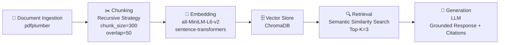

# Project 1 Planning: The Unofficial Guide

> Write this document before you write any pipeline code.
> Your spec and architecture diagram are what you'll use to direct AI tools (Claude, Copilot, etc.) to generate your implementation — the more specific they are, the more useful the generated code will be.
> Update the Retrieval Approach and Chunking Strategy sections if you change your approach during implementation.
> Update this file before starting any stretch features.

---

## Domain

<!-- What domain did you choose? Why is this knowledge valuable and hard to find through official channels? -->
Why it's valuable:

Syllabi contain a lot of information and students often need quick answers about class structure. Things like grading, office hours, late policies, and quiz schedules. Instead of reading through an entire document, students can ask a plain-language question and get a direct answer from the actual source.

Why it's hard to find officially:

Syllabi are long PDFs that require students to read through everything just to find one specific answer. Students waste time searching through pages of information, and sometimes what they are looking for isn't even there leaving them unsure whether the information exists at all.

---

## Documents

<!-- List your specific sources: URLs, subreddit names, forum threads, or file descriptions.
     Aim for at least 10 sources that together cover different subtopics or perspectives within your domain. -->

| # | Source | Description | URL or location |
|---|--------|-------------|-----------------|
| 1 |24F 302 Syllabus.pdf |Discrete Mathematical Structures |documents/24F 302 Syllabus.pdf |
| 2 |25S MAT Syllabus.pdf |Linear Algebra |documents/25S MAT Syllabus.pdf |
| 3 |26S 350 Syllabus corrected.pdf |Gragh Theory |documents/350 Syllabus corrected.pdf |
| 4 |CSC 443 Syllabus Fall 2025.docx.pdf |Software Engineering |documents/CSC 443 Syllabus Fall 2025.docx.pdf |
| 5 |CSC373 S26 Syllabus PUBLIC.pdf |Artificial Intelligence |documents/CSC373 S26 Syllabus PUBLIC.pdf |
| 6 |DST 314 Syllabus FALL 2025.docx.pdf |Programming for Data Science |documents/DST 314 Syllabus FALL 2025.docx.pdf |
| 7 |DST 490 Syllabus.pdf |Data Visualization for Social Justice  |documents/DST 490 Syllabus.pdf |
| 8 |SyllabusCSC311.pdf |Web Applications and Databases  |documents/SyllabusCSC311.pdf |
| 9 |SyllabusCSC371.pdf |Computer Organization  |documents/SyllabusCSC371.pdf |
| 10 |SyllabusCSC391.pdf |Programming Languages |documents/SyllabusCSC391.pdf |

---

## Chunking Strategy

<!-- How will you split documents into chunks?
     State your chunk size (in tokens or characters), overlap size, and explain why those
     numbers fit the structure of your documents.
     A review-heavy corpus warrants different chunking than a long FAQ. -->

**Chunk size:** 
300 characters

**Overlap:** 
50 characters

**Reasoning:** 
A chunk size of 300 characters is large enough to capture a complete syllabus section  such as office hours, grading policy, or late submission rules  without cramming multiple topics into one chunk. The 50 character overlap acts as a memory buffer at chunk boundaries, ensuring that any rule or sentence that gets cut at the edge of a chunk still appears in the next one so no meaning is lost between chunks.
Recursive chunking was chosen because all syllabi in this project have clear section headings like "Grading", "Expectations", and "Course Description." Recursive splitting uses those headings as natural cut points first, then falls back to paragraph-level splits when a section is too long. This is important because the 10 syllabi in this project are from different professors and courses so each formatted slightly differently  and recursive chunking handles that inconsistency better than fixed-size, which would blindly cut through headings and paragraphs regardless of structure.

---

## Retrieval Approach

<!-- Which embedding model are you using (e.g., all-MiniLM-L6-v2 via sentence-transformers)?
     How many chunks will you retrieve per query (top-k)?
     If you were deploying this for real users and cost wasn't a constraint, what tradeoffs
     would you weigh in choosing a different embedding model — context length, multilingual
     support, accuracy on domain-specific text, latency? -->

**Embedding model:**
all-MiniLM-L6-v2

**Top-k:**
5

**Production tradeoff reflection:**
Production tradeoff reflection: For this project, all-MiniLM-L6-v2 works well since all syllabi are in English and the system runs locally at no cost. However, if this were deployed for all students at Augsburg University, three tradeoffs would need to be addressed. First, if students speak different languages, I would switch to a multilingual embedding model such as paraphrase-multilingual-MiniLM which understands multiple languages directly without needing translation. Second, if the system became slow under heavy usage from many students, I would deploy to a cloud service and use load balancing to spread requests across multiple servers so no single server gets overwhelmed. Third, if academic terminology caused retrieval problems, I would switch to a larger model like all-mpnet-base-v2 which handles domain-specific text more accurately than the smaller model, at the tradeoff of being slower and more expensive to run.

---

## Evaluation Plan

<!-- List your 5 test questions with their expected correct answers.
     Questions should be specific enough that you can judge whether the system's response
     is right or wrong. "What are good dining halls?" is too vague.
     "What do students say about wait times at [dining hall name] during lunch?" is testable. -->

| # | Question | Expected answer |
|---|----------|-----------------|
| 1 |What are the office hours for CSC 311? |MW 1:30pm - 2:00pm, T 10:30am - 11:00am, or by appointment |
| 2 |What happens if you submit a late assignment or project in CSC 311? |Late assignments and late projects receive no credit, but projects must still be submitted |
| 3 |What is the minimum grade required for CSC 311 to count toward the Computer Science major? |C- or higher |
| 4 |What percentage of the DST 490 course grade comes from the Data Visualization Project? |25% of the overall grade |
| 5 |What is the late homework policy in DST 490? |Work is still due even if you miss class. Late homework may be submitted but no feedback will be provided, and the instructor reserves the right to limit late submissions |

---

## Anticipated Challenges

<!-- What could go wrong? Name at least two specific risks with reasoning.
     Consider: noisy or inconsistent documents, missing source attribution, off-topic
     retrieval, chunks that split key information across boundaries. -->

1. Off-topic retrieval may occur when multiple syllabi contain similar sections such as grading policies, late submission rules, or academic honesty statements. Since these sections use similar language across different courses, the embedding model may retrieve chunks from the wrong syllabus when a student asks a course-specific question. For example, returning CSC 311's grading policy when the student asked about DST 490.

2.  PDF extraction may produce noisy or misformatted text when pdfplumber processes tables and calendars inside the syllabi. Structured content like grading breakdowns and course calendars may get extracted with broken spacing, missing characters, or jumbled column order, making those chunks harder to embed accurately and reducing retrieval quality for questions about dates, deadlines, or grade percentages.

---

## Architecture

<!-- Draw a diagram of your pipeline showing the five stages:
     Document Ingestion → Chunking → Embedding + Vector Store → Retrieval → Generation
     Label each stage with the tool or library you're using.
     You can use ASCII art, a Mermaid diagram, or embed a sketch as an image.
     You'll use this diagram as context when prompting AI tools to implement each stage. -->

---

## AI Tool Plan

<!-- For each part of the pipeline below, describe:
     - Which AI tool you plan to use (Claude, Copilot, ChatGPT, etc.)
     - What you'll give it as input (which sections of this planning.md, which requirements)
     - What you expect it to produce
     - How you'll verify the output matches your spec

     "I'll use AI to help me code" is not a plan.
     "I'll give Claude my Chunking Strategy section and ask it to implement chunk_text()
     with my specified chunk size and overlap" is a plan. -->

     AI Tool: Claude

     Input: My Document Ingestion requirements from planning.md and the pdfplumber hint from the project instructions

     Expected output: A function that loads all 10 syllabus PDFs from the documents folder, extracts clean text using pdfplumber, and removes any navigation artifacts or extra whitespace

     Verification: Manually read through the extracted text for each syllabus, specifically checking that table sections like course calendars and grading breakdowns are readable and not jumbled or missing characters

**Milestone 3 — Ingestion and chunking:**

**Milestone 4 — Embedding and retrieval:**

**Milestone 5 — Generation and interface:**
